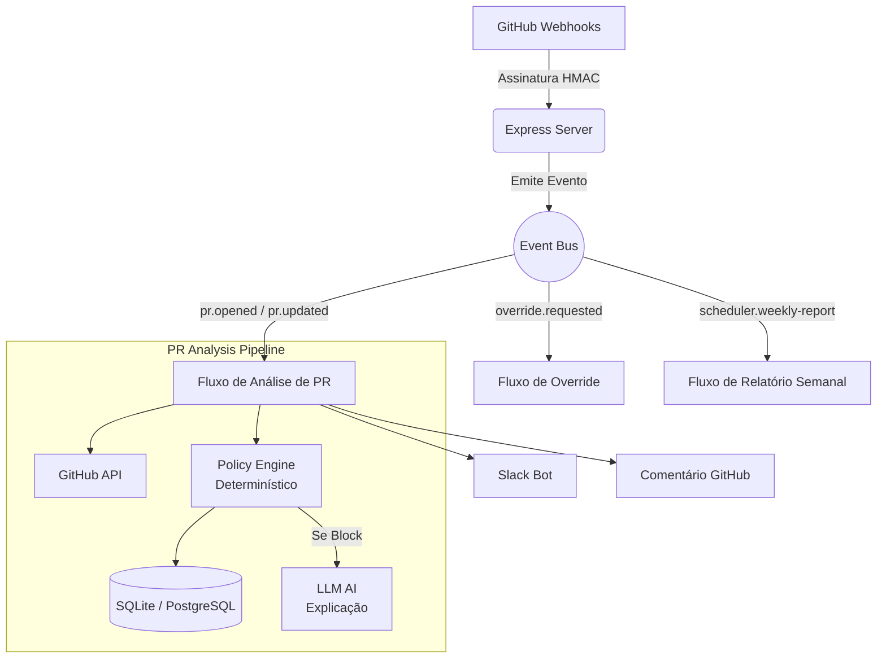

# 🛡️ Sentinel V3


O **Sentinel V3** é um sistema avançado de *PR Guardrail* (Guarda-Corpo de Pull Requests) e Motor de Inteligência de Engenharia. Ele orquestra análises estáticas determinísticas de código e métricas DORA, aplicando políticas estritas de segurança (ex: bloqueio de *hardcoded secrets* e *CVEs*) de forma autônoma e inflexível.

Diferente de bots de IA comuns, o **Sentinel V3 NÃO utiliza IA para tomar decisões de bloqueio ou aprovação**. A Inteligência Artificial (podendo utilizar qualquer LLM, como Gemini, OpenAI ou Claude) é delegada **apenas à camada de apresentação**, atuando como um mentor que traduz logs de infrações técnicos para uma linguagem acessível aos desenvolvedores, melhorando a *Developer Experience* (DX).

---

## 🏗️ Arquitetura Orientada a Eventos (Event-Driven)

O sistema opera sobre um barramento de eventos assíncrono em memória, separando a camada de ingestão de webhooks da orquestração de rotinas complexas.

### Diagrama Funcional



---

## 🧠 Núcleo Determinístico (Policy Engine)

O **Policy Engine** é o coração matemático do Sentinel. As regras não são subjetivas.

As regras atuais incluem:
- **Detecção de Segredos (`secrets.ts`)**: Regexes de alta entropia para chaves AWS, tokens Anthropic, chaves genéricas, e proteção contra falso-positivos em declarações de variáveis longas.
- **Vulnerabilidades (`cve.ts`)**: Verificação atrelada a relatórios de *dependency review* da *CI*.
- **Métricas Comportamentais (`pipeline-health.ts`)**: Reprovação automática se o pipeline de CI do PR não for bem-sucedido.
- **Tamanho e Testes (`pr-size.ts`, `tests.ts`)**: Limitação do número de linhas modificadas para combater fadiga de revisão e imposição de testes para arquivos lógicos.

### Métrica de Risco (Risk Score)
Cada PR recebe um *Risk Score* de 0 a 100.
- **`Pass`**: < 40 pontos. O código é mesclável.
- **`Warn`**: Entre 40 e 89 pontos. Avisos amarelos são enviados no Github e Slack.
- **`Block`**: 90 ou mais pontos. Uma violação de bloqueio rígido (ex: *Secret Leak* ou CVE Crítico). O Sentinel bloqueará a mesclagem até que um "Override" seja feito por um desenvolvedor Sênior.

---

## 🛠️ Tecnologias Utilizadas

- **Linguagem:** TypeScript (Strict Mode, ES2022)
- **Runtime:** Node.js v20+
- **Banco de Dados:** Knex.js conectado a SQLite (Dev) ou PostgreSQL (Prod)
- **Integrações:** `@octokit/rest` (GitHub), `@slack/bolt` (Slack), Integrações de IA (Google Gemini, expansível para qualquer LLM)
- **Testes:** Vitest (Testes Unitários e de Fluxo)

---

## 🚀 Como Rodar Localmente

### 1. Requisitos
- Node.js >= 20.x
- Conta de Serviço do GitHub (Token Classic/Fine-grained)
- App do Slack (Bot Token e Signing Secret)
- API Key de uma IA (Atualmente usa Google Gemini, mas a arquitetura suporta qualquer LLM)

### 2. Configuração do Ambiente
Crie um arquivo `.env` na raiz do diretório `app/` baseado no `.env.example`:

```bash
cp .env.example .env
```

Preencha os valores críticos:
```env
GITHUB_WEBHOOK_SECRET=sua-chave-criptografica-webhook
GITHUB_TOKEN=ghp_...
GOOGLE_API_KEY=sua-chave-api-da-llm
SLACK_BOT_TOKEN=xoxb-...
SLACK_SIGNING_SECRET=sua-assinatura-slack
```

### 3. Instalação e Execução
```bash
# Instale as dependências
npm install

# Inicie as migrações de banco (Cria o schema SQLite local em .data/)
npx knex migrate:latest

# Rode em ambiente de desenvolvimento com hot-reload
npm run dev
```

### 4. Rodando os Testes
O projeto garante sua integridade arquitetural através do `Vitest`.
```bash
npm run test
```

---

## 📜 Trilha de Auditoria (Audit Logging)

Todo `Override` realizado em cima de um PR bloqueado é salvo permanentemente em banco de dados (`override_logs`). Esses dados compõem a métrica comportamental DORA (*Change Failure Rate* vs *Rubber Stamp Rate*) distribuída pelo Relatório Semanal aos gestores e tech leads via Slack.

> A camada de retenção `memory-engine` foi obsoletada em favor das agregações pesadas em banco relacional, garantindo escalabilidade para times grandes e múltiplos repositórios sob tutela do mesmo Sentinel.
